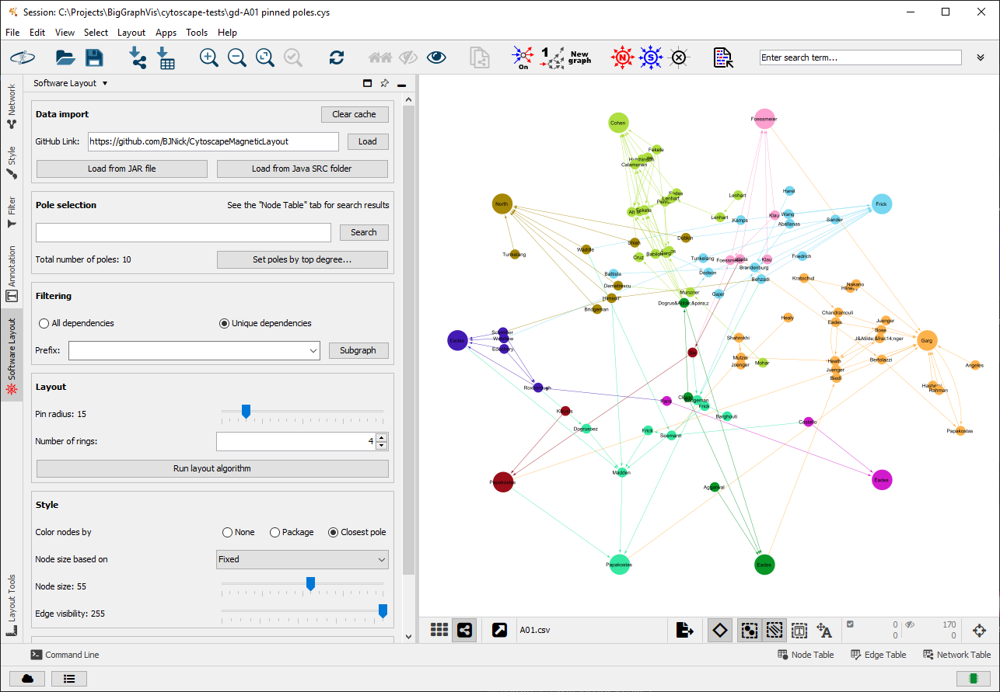

# Cytoscape Magnetic Layout

Contributors: Mykyta Shvets, Ehsan Moradi, Dr. Debajyoti Mondal

An app for Cytoscape 3.9.1+ that introduces a magnetic force to the default prefuse algorithm.

### Installation:

1. First install Cytoscape 3.9.1+ from [their official website](https://cytoscape.org/).

2. Download the app .JAR file from 
[this repository](https://github.com/BJNick/CytoscapeMagneticLayout/raw/master/target/magnetic-layout-1.0-SNAPSHOT.jar).

3. Copy the .JAR file into the folder
`USER\CytoscapeConfiguration\3\apps\installed`

4. Launch Cytoscape. A panel with the title  **Software Layout**
should appear to the left of the editor.

### Preview:

### Sample GitHub links to try out:

- https://github.com/BJNick/CytoscapeMagneticLayout
- https://github.com/TheAlgorithms/Java
- https://github.com/google/guava
- https://github.com/ReactiveX/RxJava
- https://github.com/MinecraftForge/MinecraftForge
- https://github.com/tensorflow/java
