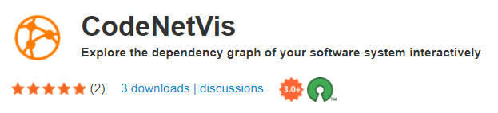

# CodeNetVis

Contributors: Mykyta Shvets, Ehsan Moradi, Debajyoti Mondal

**CodeNetVis** is an app for Cytoscape 3.9.1+ that allows you to
visualize and explore the dependency graph of a software
system.

The app can create a visualization treating
selected packages as magnetic poles. The dependencies are
visualized such that the directed paths are aligned along
the magnetic fields. This creates an easy-to-explore
visualization of the dependencies around the poles.
  

<a href="https://apps.cytoscape.org/apps/codenetvis"> Open on Cytoscape app store</a>

### Highlighted Usages:

- Revealing classes that need to be
  rigorously tested to make sure an error does not impact
  the other parts of the program.
- Finding classes that are not well related
  to each other--in function or dependency, meaning it may be
  better to reorganize them in separate packages.
- Using the polar layout to identify major dependency
  links between classes, to find groups of classes that could be
  separated into modules of their own.

---

### Introductory Video

### Quick Preview

 

### Installation:

Go to [CodeNetVis app page](https://apps.cytoscape.org/apps/codenetvis) on the Cytoscape App Store and click the "Install" button. 

Alternatively, follow the instructions below:

1. First install Cytoscape 3.9.1+ from [their official website](https://cytoscape.org/).

2. Download the app .JAR file from 
[this repository](https://github.com/vgalab/CodeNetVis/raw/master/target/codenetvis-1.0.jar).

3. Copy the .JAR file into the folder
`%userprofile%\CytoscapeConfiguration\3\apps\installed`

4. Launch Cytoscape. A panel with the title  **Software Layout**
should appear to the left of the editor.

### Sample GitHub links to try out:

- https://github.com/BJNick/CytoscapeMagneticLayout
- https://github.com/TheAlgorithms/Java
- https://github.com/google/guava
- https://github.com/ReactiveX/RxJava
- https://github.com/MinecraftForge/MinecraftForge
- https://github.com/tensorflow/java

### Used Libraries

This code uses the following libraries:

- https://github.com/cytoscape/cytoscape-api
- https://github.com/gousiosg/java-callgraph/
- https://github-api.kohsuke.org/
- https://github.com/zeroturnaround/zt-zip/
- https://github.com/javaparser/javaparser

They are built into the app, so no need to install them separately.

